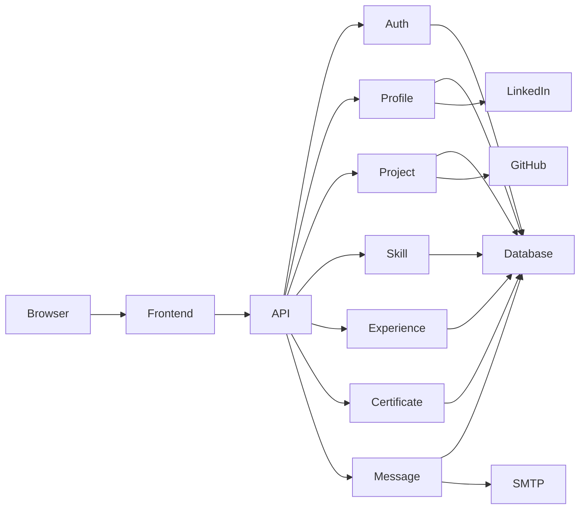
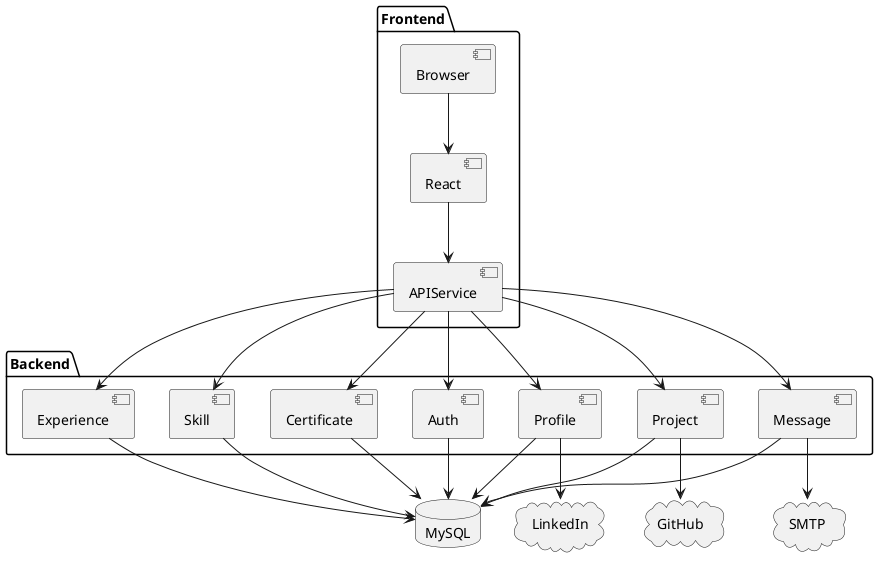

# Software Design Document (SDD)

# Chapter 6
# Component Diagram

Version : 1.0

Project :

Portfolio IT

---

# 1. Overview

Bab ini menjelaskan pembagian komponen pada aplikasi Portfolio IT beserta hubungan antar komponen.

Component Diagram digunakan untuk menggambarkan struktur logis sistem sebelum implementasi dilakukan.

Diagram ini tidak menjelaskan source code, melainkan hubungan antar modul aplikasi.

---

# 2. Tujuan

Component Diagram dibuat untuk:

- Mengidentifikasi komponen aplikasi
- Menentukan dependency
- Mempermudah maintenance
- Menjadi acuan developer
- Mendukung scalability

---

# 3. Component Overview

Portfolio IT terdiri dari empat kelompok komponen utama.

```
Frontend

Backend

Database

External Service
```

---

# 4. High Level Component

```text
+--------------------------------------------------+
|                  Portfolio IT                    |
+--------------------------------------------------+

Frontend
│
├── UI Components
├── Pages
├── Layout
├── API Service
└── Authentication

Backend
│
├── Authentication
├── Profile Module
├── Skills Module
├── Experience Module
├── Projects Module
├── Certificate Module
├── Message Module

Database

MySQL

External Service

GitHub

LinkedIn

SMTP
```

---

# 5. Component Diagram (Mermaid)



---

# 6. Component Diagram (PlantUML)



---

# 7. Frontend Components

## Pages

```
Home

About

Projects

Experience

Skills

Certificates

Contact
```

---

## Layout

```
MainLayout

DashboardLayout

AuthLayout
```

---

## Shared Components

```
Navbar

Footer

Sidebar

Button

Card

Modal

Badge

Avatar

Pagination

Toast
```

---

## Services

```
AuthService

ProfileService

ProjectService

SkillService

ExperienceService

CertificateService

MessageService
```

---

# 8. Backend Components

```
Authentication Module

↓

Profile Module

↓

Experience Module

↓

Project Module

↓

Skill Module

↓

Certificate Module

↓

Message Module
```

---

## Authentication Component

Bertanggung jawab:

- Login
- Logout
- JWT
- Authorization

---

## Profile Component

Bertanggung jawab:

- Profile CRUD
- Upload Photo
- Update CV

---

## Project Component

Mengelola:

- CRUD Project
- Upload Screenshot
- Gallery

---

## Experience Component

Mengelola:

- Pengalaman kerja
- Riwayat karir

---

## Skill Component

Mengelola:

- Skill
- Level Skill

---

## Certificate Component

Mengelola:

- Sertifikat
- Upload Sertifikat

---

## Message Component

Mengelola:

- Contact Form
- Read Message
- Delete Message

---

# 9. Database Components

```text
Users

↓

Profile

↓

Projects

↓

Project Images

↓

Skills

↓

Experience

↓

Certificates

↓

Messages
```

---

# 10. External Components

## GitHub

Digunakan untuk:

- Repository Project

---

## LinkedIn

Digunakan untuk:

- Profil Profesional

---

## SMTP

Digunakan untuk:

- Contact Notification

---

# 11. Component Dependency

```text
Frontend

↓

REST API

↓

Controller

↓

Service

↓

Repository

↓

Database
```

Dependency hanya mengarah satu arah.

---

# 12. Component Communication

```text
User

↓

Frontend

↓

Axios

↓

REST API

↓

Controller

↓

Service

↓

Repository

↓

Database

↓

JSON

↓

Frontend
```

---

# 13. Internal Component Structure

## Project Module

```text
ProjectController

↓

ProjectService

↓

ProjectRepository

↓

Project Model
```

---

## Profile Module

```text
ProfileController

↓

ProfileService

↓

ProfileRepository

↓

Profile Model
```

---

## Authentication Module

```text
LoginController

↓

AuthService

↓

JWT

↓

User Repository
```

---

# 14. Interface

## Project Repository

```
findAll()

findById()

create()

update()

delete()
```

---

## Profile Repository

```
getProfile()

updateProfile()
```

---

## Skill Repository

```
findAll()

create()

delete()
```

---

# 15. Data Flow Between Components

```
Browser

↓

React

↓

Axios

↓

REST API

↓

Controller

↓

Service

↓

Repository

↓

MySQL

↓

Repository

↓

Service

↓

Controller

↓

JSON

↓

React

↓

Browser
```

---

# 16. Component Responsibility Matrix

| Component | Responsibility |
|------------|----------------|
|Frontend UI|Rendering halaman|
|API Service|HTTP Communication|
|Controller|Request Handling|
|Service|Business Logic|
|Repository|Database Access|
|Model|Entity|
|MySQL|Data Storage|
|SMTP|Email Notification|

---

# 17. Design Principles

Component mengikuti prinsip:

- Single Responsibility
- Loose Coupling
- High Cohesion
- Dependency Injection
- Interface Segregation

---

# 18. Future Component

Apabila sistem berkembang:

```
Authentication Service

Portfolio Service

Notification Service

Media Service

Analytics Service
```

Masing-masing dapat dipisahkan menjadi microservice.

---

# 19. Risks

Beberapa risiko:

- Dependency antar modul terlalu erat.
- Business Logic bocor ke Controller.
- Circular Dependency.
- Shared Component tidak reusable.

Mitigasi:

- Gunakan Interface.
- Gunakan Dependency Injection.
- Terapkan Code Review.
- Lakukan Unit Test.

---

# 20. Summary

Component Diagram menggambarkan hubungan antar modul aplikasi Portfolio IT dan menjadi dasar implementasi Layer Architecture.

Pendekatan modular memastikan setiap komponen memiliki tanggung jawab yang jelas, mudah diuji, mudah dipelihara, dan dapat dikembangkan menjadi arsitektur yang lebih kompleks tanpa perubahan besar pada struktur aplikasi.