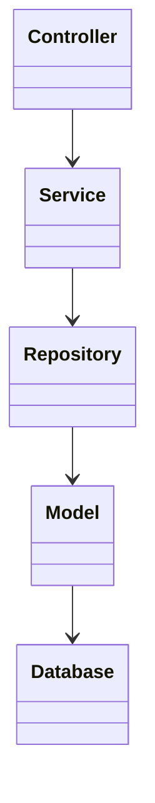
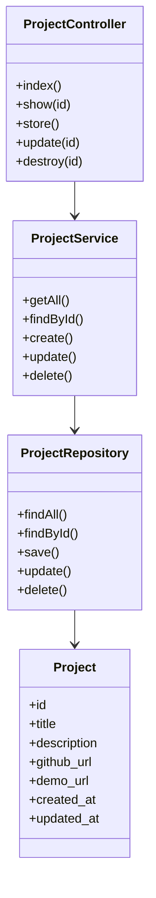
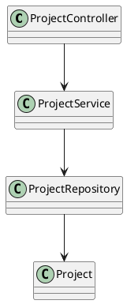
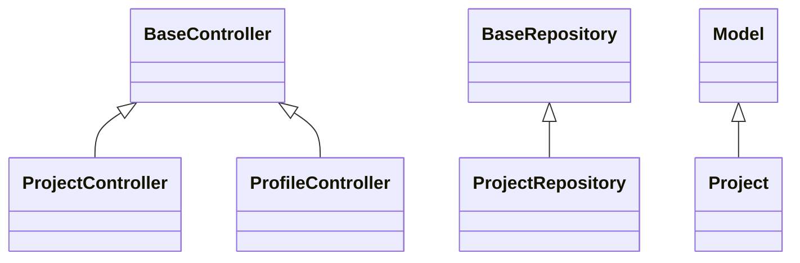
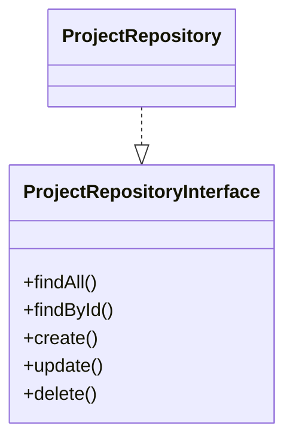

# Software Design Document (SDD)

# Chapter 7
# Class Diagram

Version : 1.0

Project :

Portfolio IT

---

# 1. Overview

Bab ini menjelaskan struktur class yang digunakan pada aplikasi Portfolio IT.

Class Diagram digunakan sebagai acuan implementasi source code, hubungan antar class, dependency, inheritance, serta pembagian tanggung jawab pada setiap layer aplikasi.

Diagram ini mengacu pada prinsip:

- SOLID
- Clean Architecture
- Repository Pattern
- Service Layer Pattern
- Dependency Injection

---

# 2. Tujuan

Class Diagram bertujuan untuk:

- Mendeskripsikan struktur object.
- Menjelaskan hubungan antar class.
- Menentukan dependency.
- Menjadi acuan implementasi developer.
- Mendukung Unit Testing.

---

# 3. Layer Class

```text
Presentation Layer

↓

Controller

↓

Service

↓

Repository Interface

↓

Repository

↓

Model

↓

Database
```

---

# 4. Class Overview

Sistem terdiri dari beberapa kelompok class.

Presentation

```
AuthController

ProfileController

ProjectController

SkillController

ExperienceController

CertificateController

MessageController
```

---

Application

```
AuthService

ProfileService

ProjectService

SkillService

ExperienceService

CertificateService

MessageService
```

---

Infrastructure

```
ProjectRepository

ProfileRepository

SkillRepository

ExperienceRepository

CertificateRepository

MessageRepository
```

---

Domain

```
User

Profile

Project

ProjectImage

Skill

Experience

Certificate

Message
```

---

# 5. High Level Class Diagram



---

# 6. Project Module Class Diagram



---

# 7. PlantUML Version



---

# 8. Entity Classes

## User

Attribute

```
id

name

email

password
```

Method

```
login()

logout()
```

---

## Profile

Attribute

```
id

user_id

photo

title

description

phone

github

linkedin

cv
```

Method

```
updateProfile()

uploadCV()
```

---

## Skill

Attribute

```
id

skill_name

level
```

Method

```
create()

update()

delete()
```

---

## Experience

Attribute

```
company

position

start_date

end_date
```

Method

```
create()

update()

delete()
```

---

## Project

Attribute

```
title

slug

description

github_url

demo_url
```

Method

```
create()

update()

uploadImage()

delete()
```

---

## Certificate

Attribute

```
title

issuer

issued_date

file
```

Method

```
upload()

delete()
```

---

## Message

Attribute

```
name

email

subject

message

is_read
```

Method

```
send()

markAsRead()

delete()
```

---

# 9. Service Classes

Service Layer berisi seluruh business logic.

Contoh

## ProjectService

Method

```
getAll()

findById()

create()

update()

delete()

uploadImage()
```

---

## ProfileService

```
getProfile()

updateProfile()

uploadCV()
```

---

## MessageService

```
sendMessage()

getMessages()

readMessage()

deleteMessage()
```

---

# 10. Repository Classes

Repository hanya menangani akses database.

Contoh

```
ProjectRepository

ProfileRepository

ExperienceRepository

SkillRepository

CertificateRepository

MessageRepository
```

Method umum

```
findAll()

findById()

create()

update()

delete()
```

---

# 11. Controller Classes

Controller menerima HTTP Request.

Contoh

```
ProjectController

↓

ProjectService

↓

Response JSON
```

Method

```
index()

show()

store()

update()

destroy()
```

---

# 12. Relationships

Association

```
Project

1

↓

N

ProjectImage
```

---

Aggregation

```
Profile

contains

Skill
```

---

Composition

```
Project

owns

ProjectImage
```

Jika Project dihapus maka seluruh gambar ikut terhapus.

---

Dependency

```
Controller

↓

Service

↓

Repository
```

---

# 13. Visibility

Public

```
+
```

Protected

```
#
```

Private

```
-
```

Contoh

```text
+create()

-updateCache()

#validateRequest()
```

---

# 14. Inheritance

Semua Controller mewarisi

```
BaseController
```

Semua Repository mewarisi

```
BaseRepository
```

Semua Model mewarisi

```
Model
```

Diagram



---

# 15. Dependency Injection

Service menerima Repository melalui Constructor.

```text
ProjectService

↓

ProjectRepositoryInterface
```

Contoh

```
__construct(ProjectRepositoryInterface $repository)
```

---

# 16. Interface Diagram



---

# 17. Design Principles

Class Diagram mengikuti:

- SOLID
- DRY
- KISS
- Repository Pattern
- Service Layer Pattern
- Interface Segregation
- Dependency Injection

---

# 18. Future Improvement

Jika sistem berkembang menjadi Microservices maka class akan dipisahkan menjadi:

```
Authentication Service

Portfolio Service

Media Service

Notification Service
```

Masing-masing memiliki class diagram sendiri.

---

# 19. Summary

Class Diagram menjadi acuan implementasi seluruh source code pada aplikasi Portfolio IT.

Dengan pemisahan Controller, Service, Repository, dan Model, aplikasi menjadi lebih modular, mudah diuji, serta mendukung pengembangan jangka panjang.