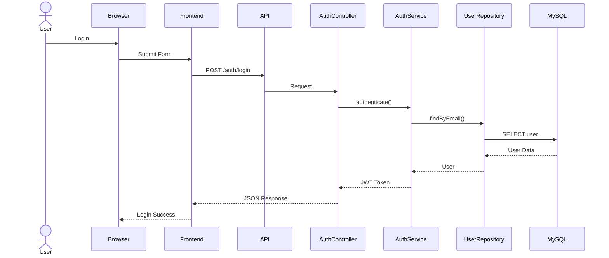
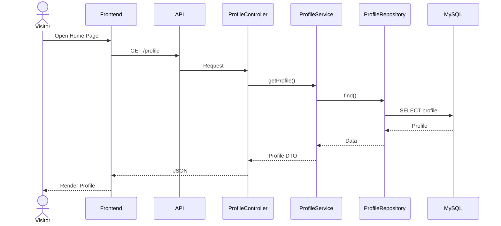
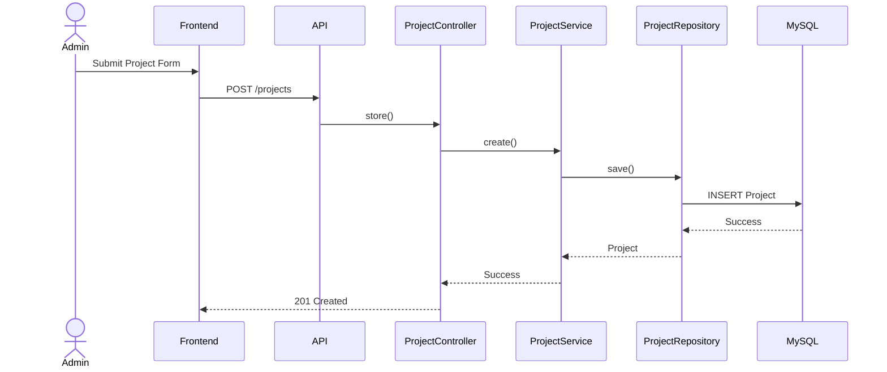
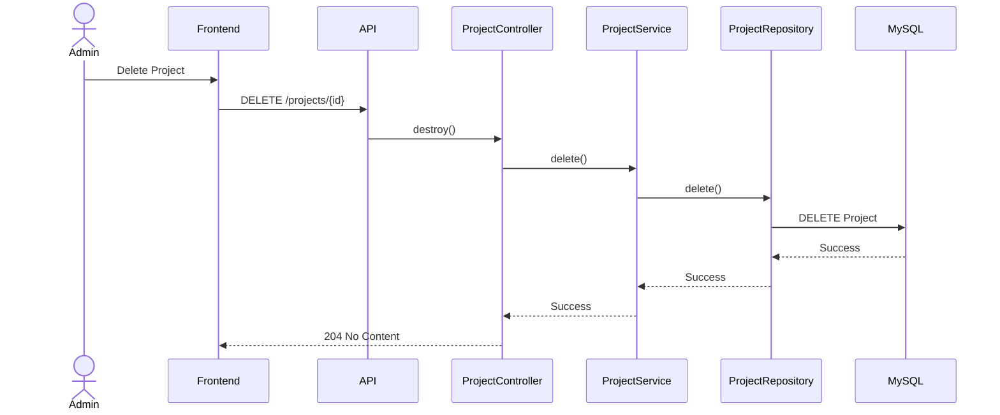
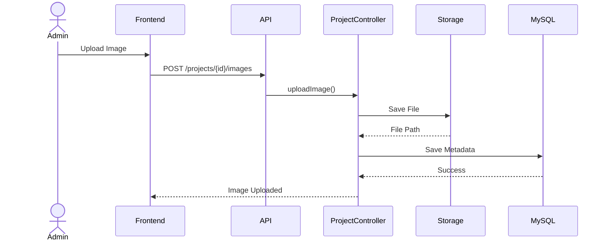
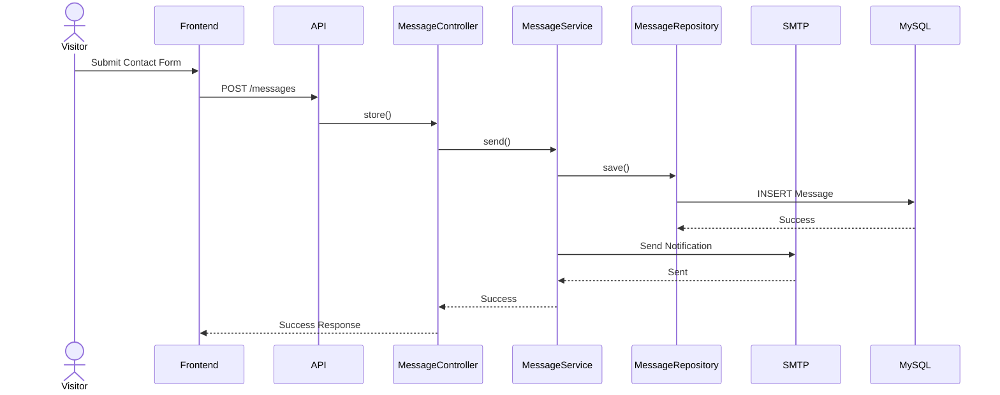
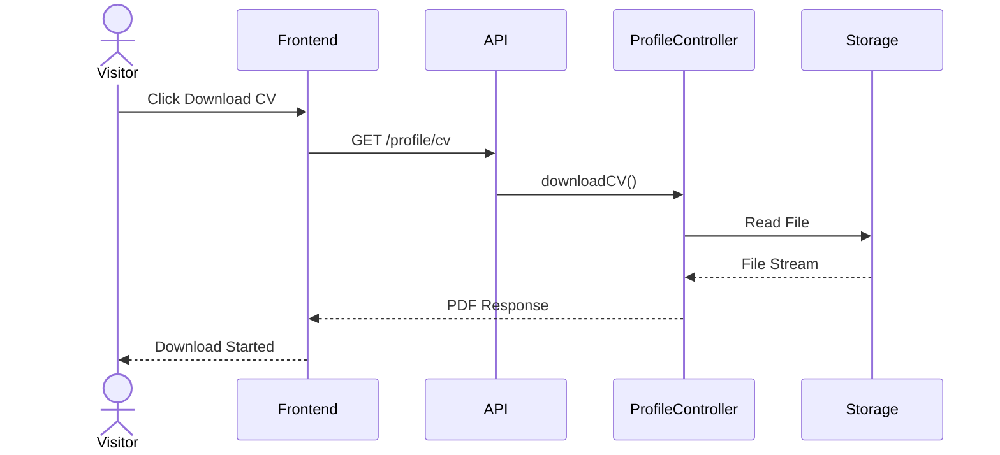
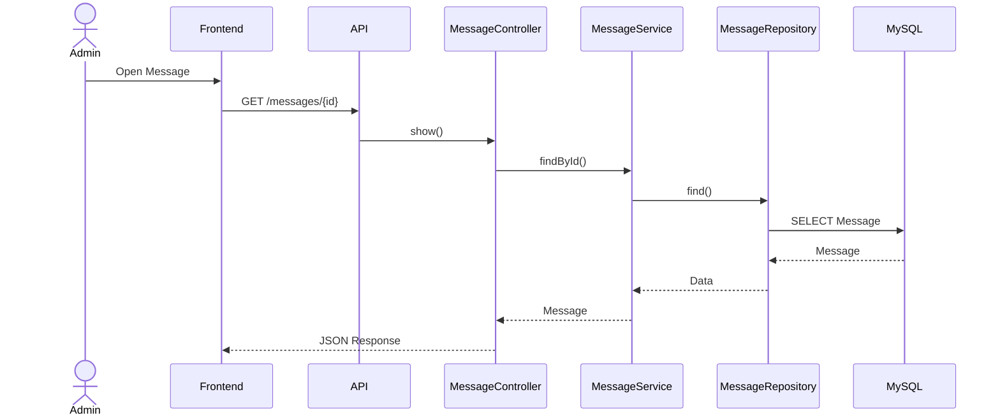
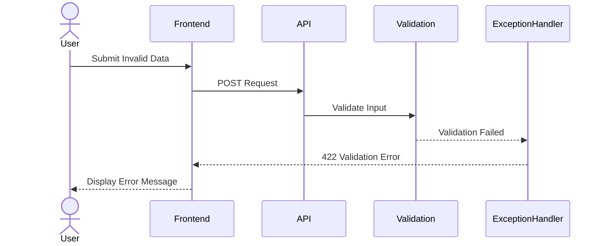
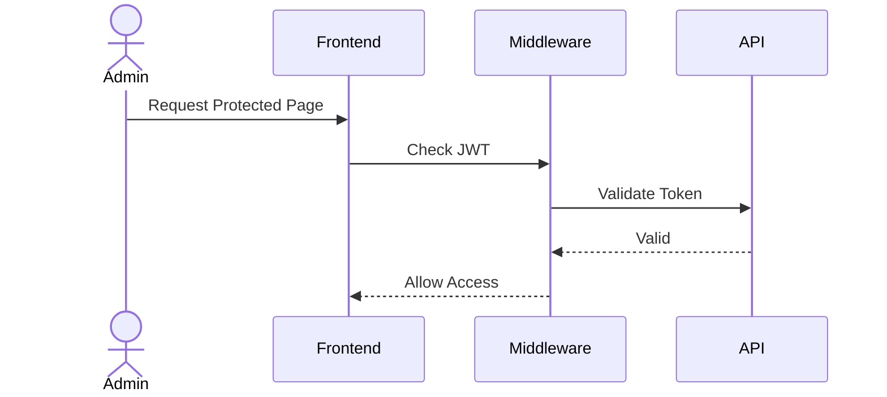

# Software Design Document (SDD)

# Chapter 8
# Sequence Diagram

Version : 1.0

Project :

Portfolio IT

---

# 1. Overview

Bab ini menjelaskan alur komunikasi antar komponen sistem berdasarkan urutan waktu (time sequence).

Sequence Diagram digunakan untuk menggambarkan bagaimana objek saling berinteraksi dalam menyelesaikan suatu proses bisnis.

Diagram dibuat menggunakan Mermaid sehingga dapat dirender langsung pada GitHub, GitLab, Azure DevOps, Obsidian, dan editor Markdown yang mendukung Mermaid.

---

# 2. Tujuan

Sequence Diagram digunakan untuk:

- Menjelaskan alur proses bisnis.
- Memperlihatkan interaksi antar objek.
- Menjadi acuan implementasi backend.
- Menjadi acuan implementasi frontend.
- Menjadi referensi QA saat menyusun test case.

---

# 3. Participant

Pada diagram berikut digunakan participant:

- User
- Browser
- Frontend (Next.js)
- API (Laravel)
- Controller
- Service
- Repository
- Database
- External Service (jika diperlukan)

---

# 4. Login Sequence

---

# 5. Get Portfolio Profile

---

# 6. Create Project

---

# 7. Update Project

---

# 8. Delete Project

---

# 9. Upload Project Image

---

# 10. Send Contact Message

---

# 11. Download CV

---

# 12. Read Message (Admin)

---

# 13. Error Handling Sequence

---

# 14. Authentication Flow

---

# 15. Best Practices

- Setiap request melewati proses validasi.
- Business logic hanya berada pada Service Layer.
- Repository hanya menangani akses data.
- Controller tidak mengakses database secara langsung.
- Gunakan transaksi database untuk operasi yang melibatkan banyak tabel.
- Gunakan asynchronous process (Queue) untuk proses berat seperti pengiriman email.

---

# 16. Summary

Sequence Diagram mendokumentasikan urutan interaksi antar komponen pada setiap fitur utama aplikasi Portfolio IT.

Dokumen ini menjadi acuan implementasi backend, frontend, integrasi API, serta penyusunan skenario pengujian oleh QA Engineer. Dengan pemisahan diagram per use case, alur sistem menjadi lebih mudah dipahami, dipelihara, dan dikembangkan.