# Software Design Document (SDD)

# Chapter 9
# Activity Diagram

Version : 1.0

Project :

Portfolio IT

---

# 1. Overview

Bab ini menjelaskan alur aktivitas (Activity Flow) dari setiap proses bisnis utama pada aplikasi Portfolio IT.

Activity Diagram digunakan untuk menggambarkan:

- Urutan aktivitas
- Decision Point
- Parallel Process
- Validation
- Error Flow
- End Process

Diagram menggunakan notasi UML Activity Diagram berbasis Mermaid.

---

# 2. Objectives

Tujuan Activity Diagram adalah:

- Memvisualisasikan alur bisnis.
- Mempermudah implementasi.
- Menjadi referensi QA.
- Menjadi acuan Frontend dan Backend Developer.
- Mengidentifikasi kemungkinan error pada proses bisnis.

---

# 3. Business Process Overview

Aplikasi Portfolio IT memiliki proses bisnis utama sebagai berikut:

- Authentication
- Manage Profile
- Manage Skills
- Manage Experience
- Manage Projects
- Manage Certificates
- Contact Form
- Download CV

---

# 4. Login Activity

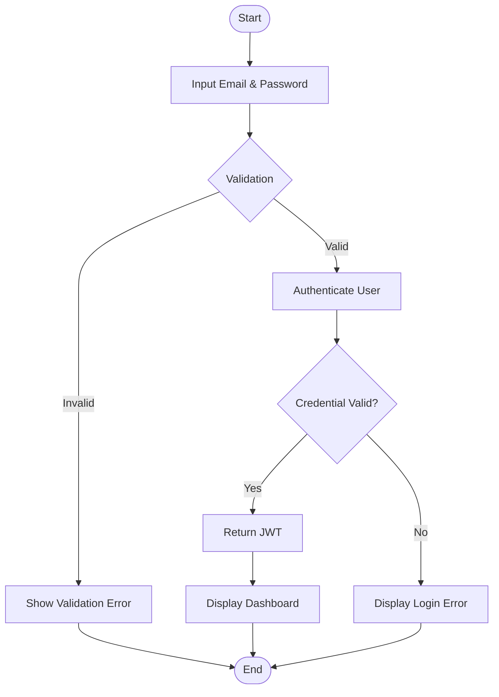

---

# 5. View Portfolio Activity

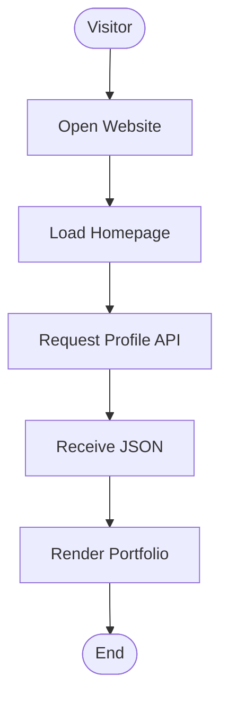

---

# 6. Create Project Activity

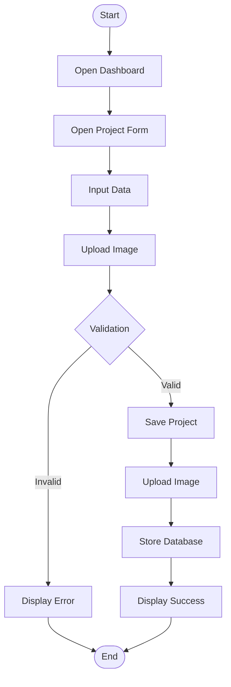

---

# 7. Update Project Activity

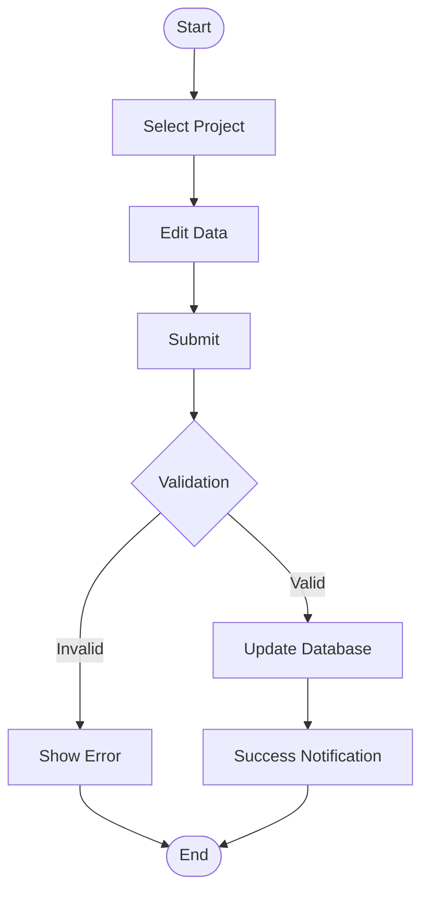

---

# 8. Delete Project Activity

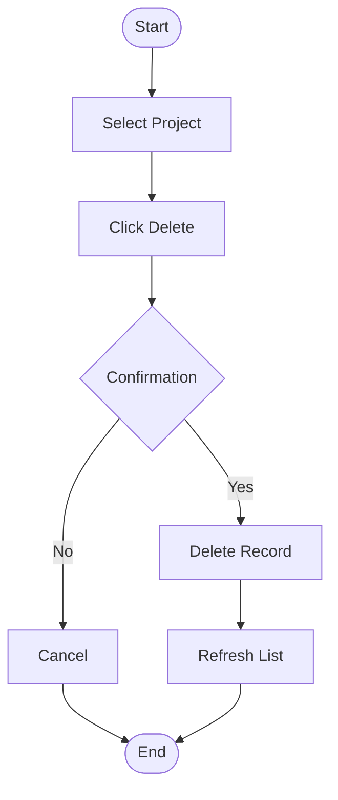

---

# 9. Upload Certificate Activity

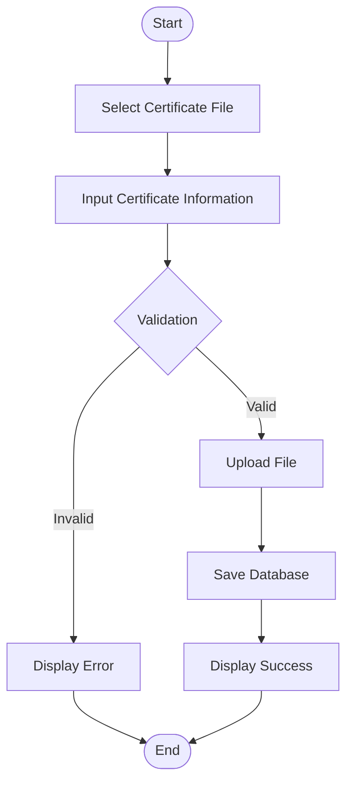

---

# 10. Contact Form Activity

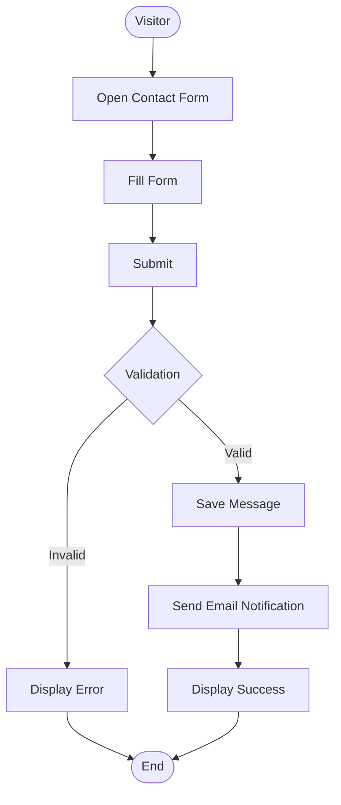

---

# 11. Download CV Activity

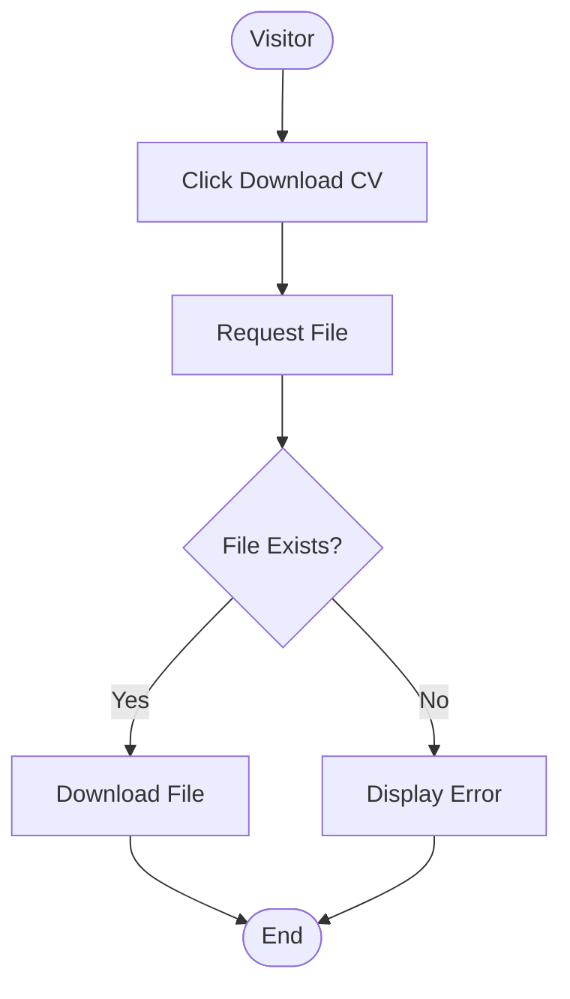

---

# 12. Read Message Activity

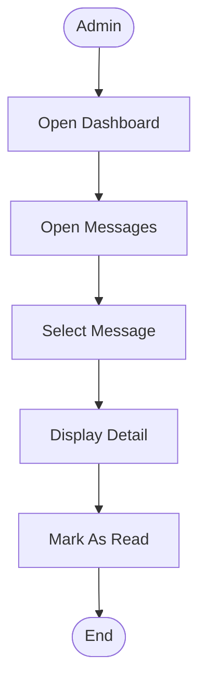

---

# 13. Logout Activity

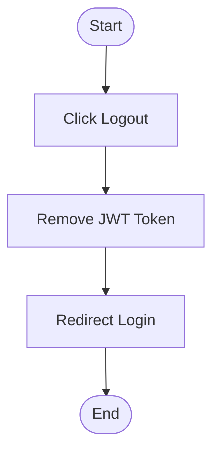

---

# 14. Error Handling Activity

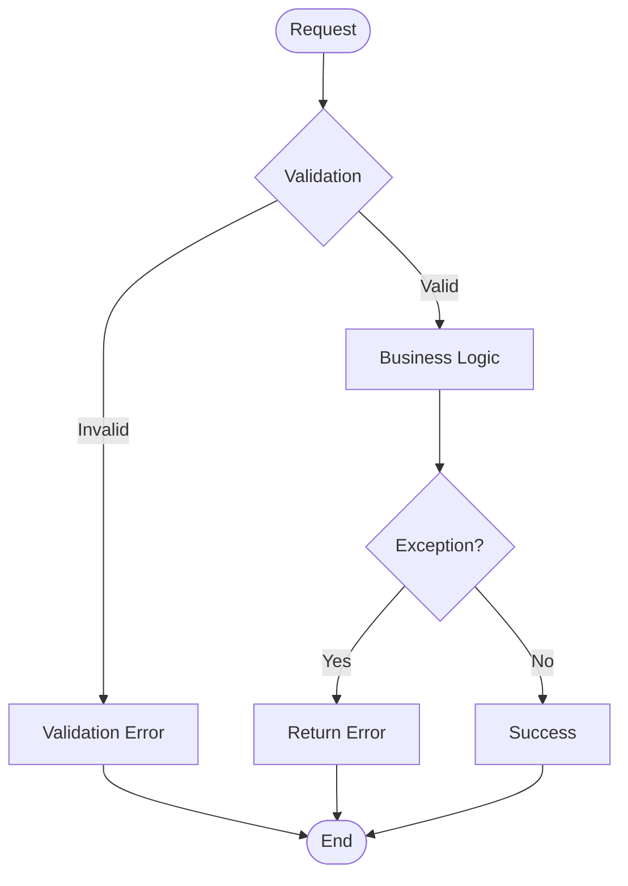

---

# 15. Activity Matrix

| Activity | Actor | Output |
|----------|-------|--------|
| Login | Admin | JWT Token |
| View Portfolio | Visitor | Portfolio Page |
| Create Project | Admin | New Project |
| Update Project | Admin | Updated Project |
| Delete Project | Admin | Project Removed |
| Upload Certificate | Admin | Certificate Stored |
| Contact Form | Visitor | Message Saved |
| Download CV | Visitor | PDF Download |
| Read Message | Admin | Message Detail |
| Logout | Admin | Session Closed |

---

# 16. Swimlane Overview

Activity Diagram dapat dikembangkan menggunakan Swimlane.

Contoh Swimlane:

```text
Visitor

↓

Frontend

↓

Backend

↓

Database

↓

Storage

↓

SMTP
```

Swimlane membantu memperjelas tanggung jawab setiap komponen dalam proses bisnis.

---

# 17. Best Practices

- Setiap aktivitas dimulai dengan Initial Node dan diakhiri dengan Final Node.
- Gunakan Decision Node untuk validasi atau percabangan.
- Hindari aktivitas yang terlalu kompleks dalam satu diagram.
- Pisahkan diagram berdasarkan use case utama.
- Dokumentasikan exception flow untuk setiap proses penting.

---

# 18. Summary

Activity Diagram memberikan gambaran lengkap mengenai alur proses bisnis aplikasi Portfolio IT.

Diagram ini menjadi acuan implementasi, pengujian, serta dokumentasi proses bisnis. Dengan memisahkan setiap use case ke dalam diagram tersendiri, alur sistem menjadi lebih mudah dipahami, dipelihara, dan dikembangkan.