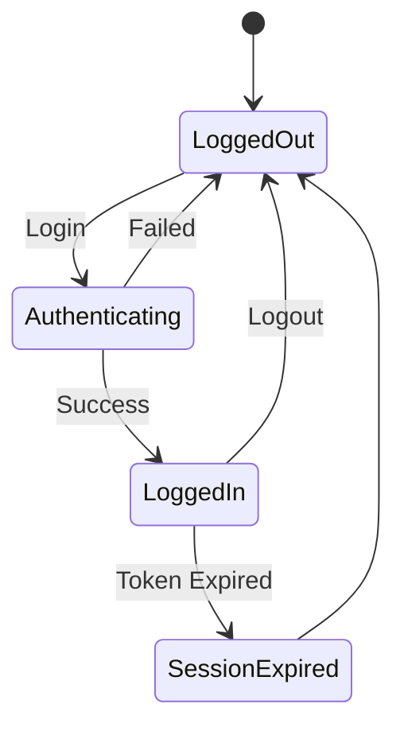
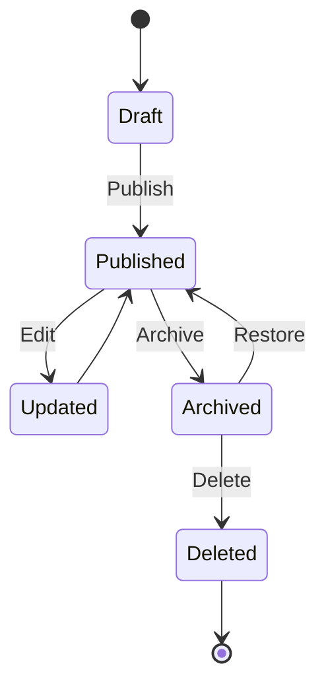
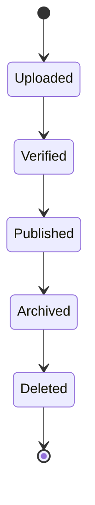
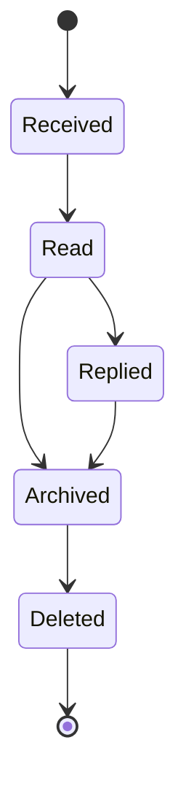
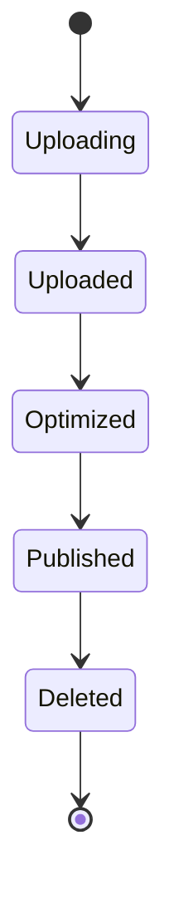
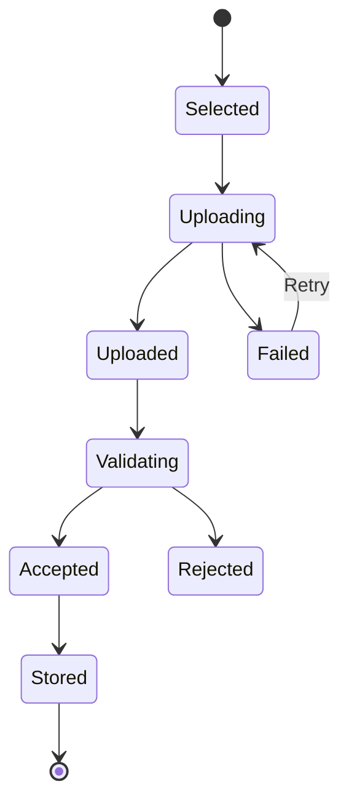
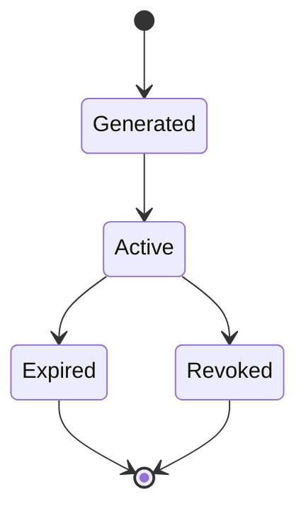
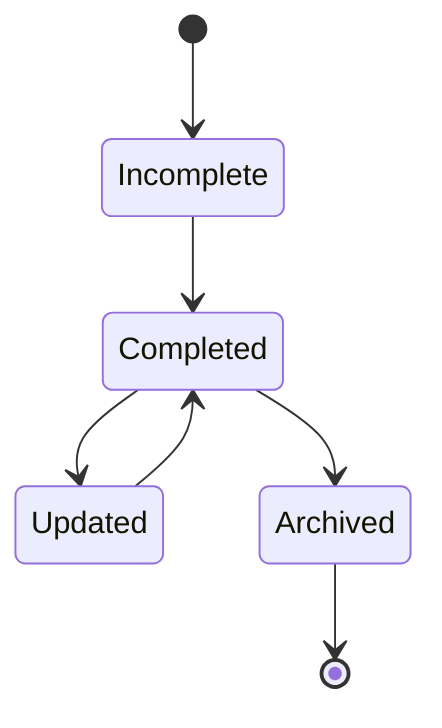

# Software Design Document (SDD)

# Chapter 10
# State Diagram

Version : 1.0

Project :

Portfolio IT

---

# 1. Overview

Bab ini menjelaskan perubahan status (State Transition) dari setiap objek utama dalam aplikasi Portfolio IT.

State Diagram digunakan untuk mendokumentasikan lifecycle suatu entitas mulai dari dibuat, diperbarui, digunakan, hingga dihapus atau dinonaktifkan.

Diagram menggunakan notasi UML State Machine berbasis Mermaid.

---

# 2. Objectives

State Diagram bertujuan untuk:

- Menjelaskan lifecycle setiap entitas.
- Mendokumentasikan perubahan status.
- Menjadi acuan implementasi backend.
- Mempermudah validasi workflow.
- Mendukung pengujian berbasis state.

---

# 3. State Machine Overview

Entitas yang memiliki lifecycle pada aplikasi:

- User Session
- Project
- Project Image
- Certificate
- Contact Message
- File Upload
- Authentication Token

---

# 4. User Session State

## Description

Session dimulai ketika administrator berhasil login dan berakhir ketika logout atau token kedaluwarsa.



### State Description

| State | Description |
|---------|-------------|
| LoggedOut | Pengguna belum login |
| Authenticating | Proses autentikasi berlangsung |
| LoggedIn | Pengguna berhasil login |
| SessionExpired | JWT Token kedaluwarsa |

---

# 5. Project State

## Description

Lifecycle data Project.



### State Description

| State | Description |
|---------|-------------|
| Draft | Data baru dibuat |
| Published | Ditampilkan pada website |
| Updated | Sedang diperbarui |
| Archived | Tidak tampil ke publik |
| Deleted | Data dihapus |

---

# 6. Certificate State



### Description

- Uploaded → File berhasil diunggah.
- Verified → Administrator memverifikasi data.
- Published → Ditampilkan pada website.
- Archived → Disembunyikan sementara.
- Deleted → Data dihapus permanen.

---

# 7. Contact Message State



### State Description

| State | Description |
|---------|-------------|
| Received | Pesan baru diterima |
| Read | Pesan telah dibaca |
| Replied | Balasan telah dikirim |
| Archived | Pesan diarsipkan |
| Deleted | Pesan dihapus |

---

# 8. Project Image State



### Description

- Uploading → File sedang dikirim.
- Uploaded → File berhasil diterima.
- Optimized → Gambar telah dikompresi.
- Published → Digunakan pada website.
- Deleted → File dihapus.

---

# 9. File Upload State



### State Description

| State | Description |
|---------|-------------|
| Selected | File dipilih pengguna |
| Uploading | File sedang diunggah |
| Uploaded | File diterima server |
| Validating | Pemeriksaan tipe dan ukuran file |
| Accepted | File valid |
| Rejected | File tidak memenuhi syarat |
| Stored | File berhasil disimpan |

---

# 10. Authentication Token State



### Description

- Generated → Token dibuat.
- Active → Token digunakan.
- Expired → Masa berlaku habis.
- Revoked → Token dicabut saat logout.

---

# 11. Profile State



### Description

Profil dianggap **Completed** apabila seluruh informasi penting (nama, foto, deskripsi, kontak, dan tautan profesional) telah diisi.

---

# 12. State Transition Rules

| Entity | Allowed Transition |
|----------|--------------------|
| Project | Draft → Published |
| Project | Published → Updated |
| Project | Published → Archived |
| Certificate | Uploaded → Verified |
| Certificate | Verified → Published |
| Message | Received → Read |
| Message | Read → Replied |
| Token | Generated → Active |
| Token | Active → Expired |

---

# 13. Invalid State Transition

Perubahan status berikut tidak diperbolehkan:

| Invalid Transition | Reason |
|--------------------|--------|
| Deleted → Published | Data sudah dihapus |
| Expired → Active | Token harus dibuat ulang |
| Rejected → Stored | File harus diunggah ulang |
| Archived → Draft | Draft hanya untuk data baru |

Backend wajib melakukan validasi terhadap transisi status agar konsisten dengan aturan bisnis.

---

# 14. State Responsibility

| Component | Responsibility |
|------------|----------------|
| Controller | Menerima request perubahan status |
| Service | Memvalidasi transisi state |
| Repository | Menyimpan perubahan ke database |
| Database | Menyimpan status terbaru |

---

# 15. Error Handling

Apabila transisi status tidak valid:

1. Service menghentikan proses.
2. Exception dilempar ke Global Exception Handler.
3. API mengembalikan HTTP 422 (Unprocessable Entity).
4. Frontend menampilkan pesan kesalahan kepada pengguna.

Contoh respons:

```json
{
  "success": false,
  "message": "Invalid state transition."
}
```

---

# 16. Best Practices

- Gunakan Enum untuk mendefinisikan seluruh state.
- Hindari penggunaan string literal pada kode.
- Seluruh perubahan status dilakukan melalui Service Layer.
- Catat perubahan state penting ke dalam audit log.
- Gunakan transaksi database untuk perubahan status yang memengaruhi lebih dari satu tabel.

---

# 17. Future Enhancement

Apabila aplikasi berkembang, workflow dapat diperluas dengan:

- Approval Workflow.
- Multi-Level Verification.
- Soft Delete & Restore.
- Audit Trail.
- Version History.
- Event-Driven State Machine.
- Workflow Engine (misalnya Temporal atau Camunda).

---

# 18. Summary

State Diagram mendokumentasikan lifecycle setiap entitas utama pada aplikasi Portfolio IT.

Dengan memodelkan perubahan status secara eksplisit, implementasi backend menjadi lebih konsisten, validasi workflow lebih mudah dilakukan, dan pengujian berbasis state dapat diterapkan dengan lebih efektif.