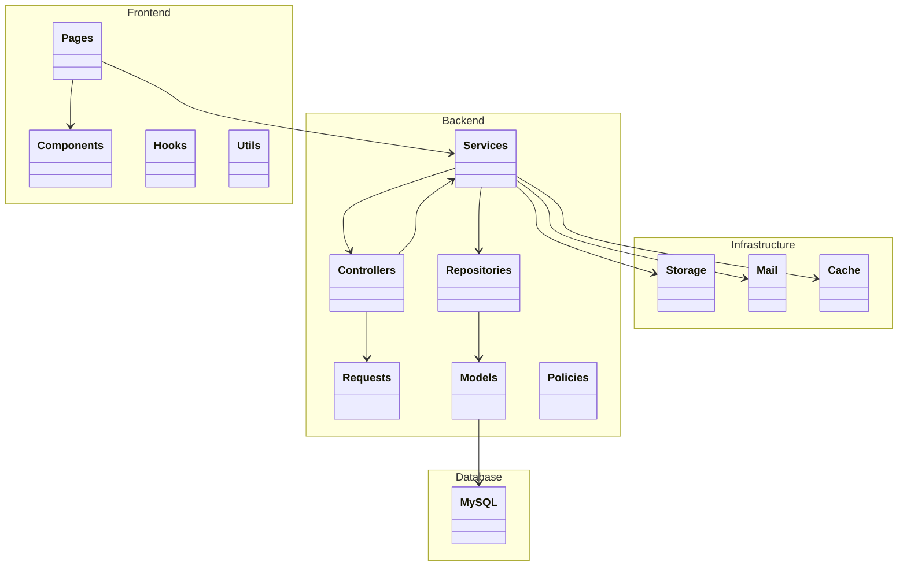
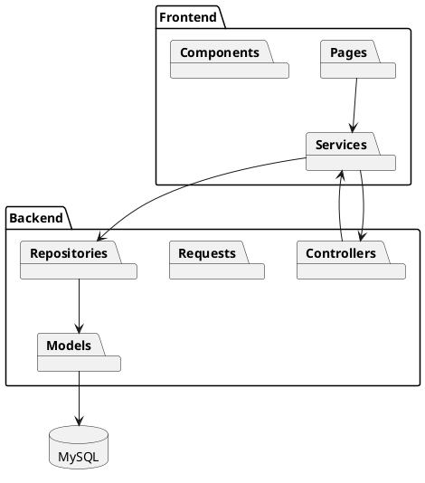

# Software Design Document (SDD)

# Chapter 11
# Package Diagram

Version : 1.0

Project :

Portfolio IT

---

# 1. Overview

Package Diagram menggambarkan bagaimana source code dikelompokkan menjadi beberapa package (modul) serta hubungan dependensi antar package.

Dokumen ini memastikan struktur proyek tetap konsisten, modular, dan mudah dipelihara selama siklus pengembangan.

Package Diagram mengikuti prinsip:

- Clean Architecture
- Layered Architecture
- Modular Design
- SOLID Principle

---

# 2. Objectives

Tujuan Package Diagram adalah:

- Mengelompokkan source code.
- Menentukan dependency antar package.
- Mengurangi coupling.
- Meningkatkan maintainability.
- Mempermudah pengembangan fitur baru.

---

# 3. High Level Package

```text
Portfolio IT

├── Frontend
├── Backend
├── Database
├── Infrastructure
├── Shared
└── External Services
```

---

# 4. Overall Package Diagram (Mermaid)



---

# 5. Frontend Package

```text
frontend/

src/

├── app/
├── components/
├── hooks/
├── services/
├── lib/
├── utils/
├── types/
├── contexts/
├── providers/
├── assets/
└── styles/
```

---

## Package Responsibility

| Package | Responsibility |
|----------|----------------|
| app | Routing & Pages |
| components | Reusable UI |
| hooks | Custom Hooks |
| services | API Client |
| lib | Shared Library |
| utils | Helper Function |
| types | TypeScript Types |
| contexts | Global State |
| providers | Provider Configuration |
| assets | Static Files |

---

# 6. Backend Package

```text
backend/

app/

├── Http/
├── Services/
├── Repositories/
├── Interfaces/
├── Models/
├── Policies/
├── Traits/
├── Enums/
├── Exceptions/
├── Helpers/
└── Providers/
```

---

## Package Responsibility

| Package | Responsibility |
|----------|----------------|
| Http | Controller, Middleware, Request |
| Services | Business Logic |
| Repositories | Database Access |
| Interfaces | Repository Contract |
| Models | Entity |
| Policies | Authorization |
| Traits | Shared Behavior |
| Enums | Constants |
| Exceptions | Custom Exception |
| Helpers | Utility Function |
| Providers | Service Registration |

---

# 7. HTTP Package

```text
Http

├── Controllers

├── Middleware

├── Requests

└── Resources
```

Dependency

```text
Controller

↓

Service

↓

Repository
```

Controller tidak boleh mengakses database secara langsung.

---

# 8. Service Package

```text
Services

├── AuthService

├── ProfileService

├── SkillService

├── ExperienceService

├── ProjectService

├── CertificateService

└── MessageService
```

Service menjadi pusat seluruh business logic.

---

# 9. Repository Package

```text
Repositories

├── ProjectRepository

├── ProfileRepository

├── SkillRepository

├── ExperienceRepository

├── CertificateRepository

└── MessageRepository
```

Repository hanya menangani akses data.

---

# 10. Model Package

```text
Models

├── User

├── Profile

├── Project

├── ProjectImage

├── Skill

├── Experience

├── Certificate

└── Message
```

Seluruh Model menggunakan Eloquent ORM.

---

# 11. Infrastructure Package

```text
Infrastructure

├── Storage

├── Mail

├── Queue

├── Cache

└── Logging
```

---

# 12. Shared Package

Shared Package berisi komponen yang dapat digunakan lintas modul.

```text
Shared

├── DTO

├── Enum

├── Constant

├── Exception

├── Helper

└── Validator
```

---

# 13. External Package

```text
External

GitHub API

SMTP

Cloud Storage
```

Integrasi dilakukan melalui adapter/service khusus agar tidak mengikat business logic pada vendor tertentu.

---

# 14. Package Dependency

```text
Frontend

↓

REST API

↓

Controller

↓

Service

↓

Repository

↓

Model

↓

Database
```

Dependency hanya mengarah satu arah.

---

# 15. Dependency Rules

| Source | Allowed Dependency |
|----------|-------------------|
| Controller | Service |
| Service | Repository |
| Repository | Model |
| Model | Database |
| Service | External Service |
| Frontend | API |

Tidak diperbolehkan:

- Controller → Database
- Frontend → Database
- Model → Controller
- Repository → Frontend

---

# 16. Package Visibility

| Package | Visibility |
|----------|------------|
| Components | Public |
| Services | Internal |
| Repositories | Internal |
| Models | Internal |
| Database | Private |

---

# 17. Package Interaction Example

### Create Project

```text
Frontend

↓

ProjectController

↓

ProjectService

↓

ProjectRepository

↓

Project Model

↓

Database
```

---

# 18. Package Diagram (PlantUML)



---

# 19. Best Practices

- Satu package memiliki satu tanggung jawab utama.
- Hindari circular dependency.
- Jangan membuat package yang terlalu besar.
- Gunakan Interface untuk komunikasi antar package.
- Pisahkan shared code dari business module.
- Terapkan Dependency Injection pada implementasi package.

---

# 20. Future Modularization

Apabila aplikasi berkembang menjadi microservices, package dapat dipisahkan menjadi layanan independen:

```text
Authentication Service

Portfolio Service

Media Service

Notification Service

Analytics Service
```

Setiap service memiliki package internal sendiri dengan struktur yang serupa.

---

# 21. Summary

Package Diagram mendokumentasikan struktur logis source code dan hubungan antar package pada aplikasi Portfolio IT.

Dengan pengelompokan yang jelas serta aturan dependency yang ketat, proyek menjadi lebih mudah dipelihara, mendukung kolaborasi tim, dan siap dikembangkan menjadi aplikasi berskala enterprise.