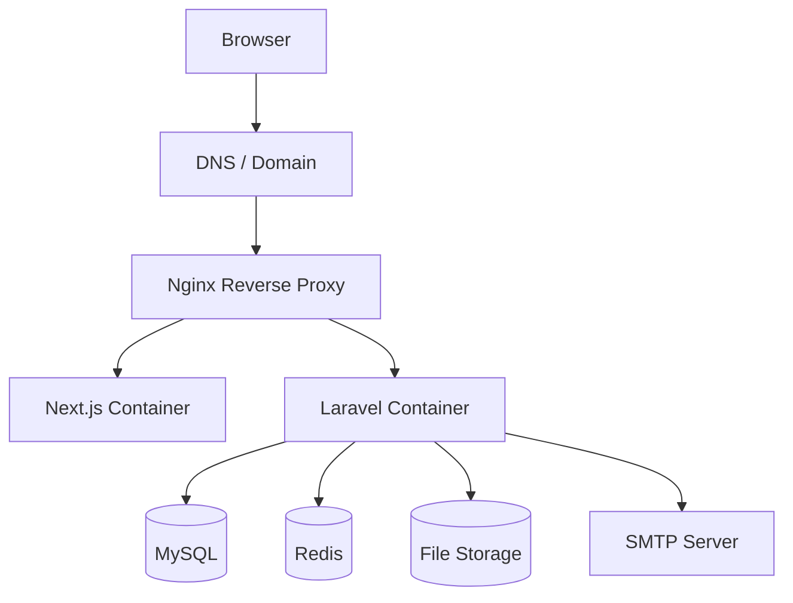
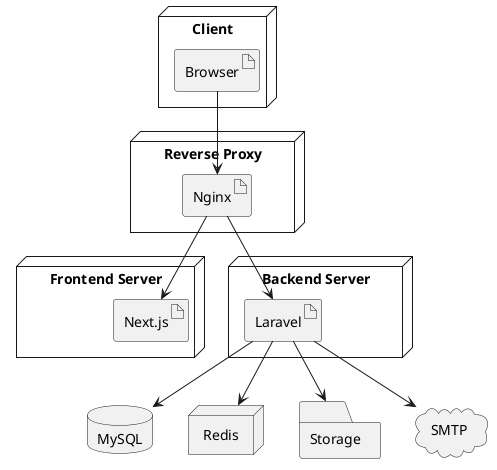
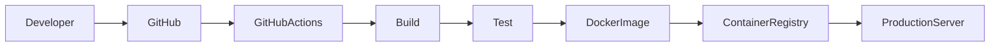

# Software Design Document (SDD)

# Chapter 12
# Deployment Diagram

Version : 1.0

Project :

Portfolio IT

---

# 1. Overview

Deployment Diagram menjelaskan bagaimana komponen aplikasi di-deploy ke infrastruktur fisik maupun virtual.

Dokumen ini menggambarkan hubungan antara client, web server, application server, database, storage, dan layanan eksternal.

Deployment dirancang agar mendukung lingkungan:

- Development
- Staging
- Production

---

# 2. Objectives

Deployment Diagram bertujuan untuk:

- Menjelaskan arsitektur deployment.
- Menentukan lokasi setiap komponen aplikasi.
- Mendokumentasikan komunikasi antar server.
- Menjadi acuan DevOps Engineer.
- Mendukung skalabilitas dan keamanan.

---

# 3. Deployment Environment

| Environment | Purpose |
|--------------|---------|
| Development | Pengembangan dan debugging |
| Staging | Pengujian sebelum produksi |
| Production | Digunakan oleh pengguna akhir |

---

# 4. High-Level Deployment Architecture

```text
                Internet
                    │
                    ▼
            DNS / Domain Name
                    │
                    ▼
            Reverse Proxy (Nginx)
                    │
         ┌──────────┴──────────┐
         ▼                     ▼
   Next.js Frontend      Laravel API
         │                     │
         └──────────┬──────────┘
                    ▼
                 MySQL
                    │
         ┌──────────┴──────────┐
         ▼                     ▼
      File Storage          Redis (Optional)
                    │
                    ▼
            SMTP / Email Server
```

---

# 5. Deployment Diagram (Mermaid)



---

# 6. Deployment Diagram (PlantUML)



---

# 7. Development Deployment

```text
Developer Machine

├── Docker Desktop
├── Nginx
├── Next.js
├── Laravel
├── MySQL
├── Redis
└── Mailhog
```

Karakteristik:

- Seluruh layanan berjalan menggunakan Docker Compose.
- Mailhog digunakan untuk simulasi email.
- Volume digunakan untuk sinkronisasi source code.

---

# 8. Staging Deployment

```text
Staging VPS

├── Nginx
├── Next.js
├── Laravel
├── MySQL
├── Redis
└── SMTP
```

Karakteristik:

- Konfigurasi menyerupai Production.
- Digunakan untuk UAT dan Regression Testing.
- Database terpisah dari Production.

---

# 9. Production Deployment

```text
Production Server

├── Nginx Reverse Proxy
├── Next.js
├── Laravel API
├── Queue Worker
├── Scheduler
├── MySQL
├── Redis
├── Object Storage
└── SMTP
```

Karakteristik:

- HTTPS aktif.
- Monitoring aktif.
- Backup otomatis.
- Logging terpusat.

---

# 10. Docker Deployment

Komponen Docker:

```text
docker-compose.yml

├── nginx

├── frontend

├── backend

├── mysql

├── redis

└── phpmyadmin (Development Only)
```

Container saling berkomunikasi melalui Docker Network.

---

# 11. Network Architecture

```text
Internet

↓

HTTPS 443

↓

Nginx

↓

Internal Docker Network

↓

Frontend

↓

Backend

↓

Database
```

Semua komunikasi internal menggunakan jaringan privat Docker.

---

# 12. CI/CD Deployment Flow



Pipeline:

1. Push ke repository.
2. Build aplikasi.
3. Jalankan Unit Test.
4. Build Docker Image.
5. Push ke Container Registry.
6. Deploy ke Server Production.

---

# 13. Storage Architecture

```text
Application

↓

Storage Service

↓

Local Storage (Development)

↓

Object Storage (Production)
```

Jenis file:

- Foto Profil
- Gambar Project
- Sertifikat
- CV (PDF)

---

# 14. Database Deployment

```text
Application

↓

MySQL Primary

↓

Backup Storage
```

Strategi:

- Daily Backup
- Binary Log
- Point-In-Time Recovery (PITR)
- Enkripsi Backup

---

# 15. Queue & Scheduler

Queue digunakan untuk proses asynchronous:

- Pengiriman Email
- Optimasi Gambar
- Notifikasi

Scheduler digunakan untuk:

- Pembersihan file sementara.
- Rotasi log.
- Backup otomatis.
- Pemeriksaan kesehatan sistem.

---

# 16. Security Deployment

Keamanan yang diterapkan:

- HTTPS (TLS/SSL)
- Firewall
- Reverse Proxy
- JWT Authentication
- Rate Limiting
- CORS Configuration
- Environment Variable (.env)
- Secret Management
- Database Authentication

---

# 17. Monitoring & Logging

Komponen monitoring:

```text
Application

↓

Log File

↓

Monitoring Service

↓

Alert
```

Monitoring meliputi:

- CPU Usage
- Memory Usage
- Disk Usage
- Response Time
- Error Rate
- Queue Status

Logging meliputi:

- Access Log
- Error Log
- Application Log
- Audit Log

---

# 18. Scaling Strategy

### Vertical Scaling

- Menambah CPU.
- Menambah RAM.
- Menggunakan SSD yang lebih cepat.

### Horizontal Scaling

```text
Load Balancer

├── App Server 1

├── App Server 2

└── App Server 3
```

Database tetap menjadi sumber data utama dan dapat dikembangkan dengan replikasi bila diperlukan.

---

# 19. Disaster Recovery

Strategi pemulihan:

- Backup Database Harian.
- Backup File Storage.
- Backup Environment Configuration.
- Recovery Test Berkala.
- Rollback Deployment.
- Health Check sebelum aplikasi menerima trafik.

Target:

| Metric | Target |
|---------|--------|
| RPO | ≤ 24 Jam |
| RTO | ≤ 2 Jam |

---

# 20. Deployment Responsibility Matrix

| Component | Responsibility |
|------------|----------------|
| Nginx | Reverse Proxy & SSL |
| Next.js | Frontend Application |
| Laravel | REST API & Business Logic |
| MySQL | Data Persistence |
| Redis | Cache & Queue |
| Storage | File Management |
| SMTP | Email Delivery |
| GitHub Actions | CI/CD Pipeline |

---

# 21. Best Practices

- Pisahkan environment Development, Staging, dan Production.
- Jangan menyimpan kredensial di source code.
- Gunakan Docker untuk konsistensi deployment.
- Aktifkan HTTPS pada semua environment publik.
- Terapkan backup dan restore secara berkala.
- Gunakan monitoring dan alerting untuk mendeteksi masalah lebih awal.
- Dokumentasikan seluruh konfigurasi deployment.

---

# 22. Summary

Deployment Diagram mendokumentasikan arsitektur infrastruktur aplikasi Portfolio IT mulai dari browser pengguna hingga layanan backend, database, penyimpanan file, dan layanan eksternal.

Dokumen ini menjadi acuan bagi tim DevOps untuk melakukan deployment yang aman, konsisten, mudah dipelihara, serta siap dikembangkan ke lingkungan dengan kebutuhan trafik yang lebih tinggi.