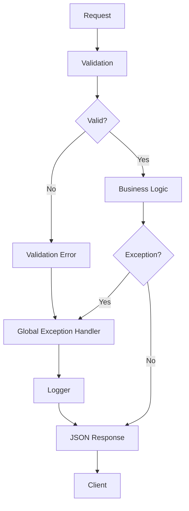
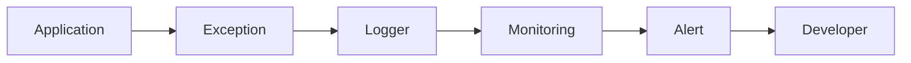

# Software Design Document (SDD)

# Chapter 14
# Error Handling

Version : 1.0

Project :

Portfolio IT

---

# 1. Overview

Bab ini menjelaskan standar penanganan kesalahan (Error Handling) pada aplikasi Portfolio IT.

Error Handling bertujuan untuk:

- Menangani error secara konsisten.
- Memberikan informasi yang jelas kepada pengguna.
- Mencegah kebocoran informasi sensitif.
- Mempermudah debugging.
- Mendukung monitoring dan observability.

Seluruh error harus ditangani melalui mekanisme terpusat (Global Exception Handling).

---

# 2. Objectives

Tujuan Error Handling:

- Konsistensi response API.
- Meningkatkan User Experience.
- Mempermudah troubleshooting.
- Mendukung audit dan logging.
- Mencegah crash aplikasi.

---

# 3. Error Handling Architecture

```text
Client

↓

Frontend Validation

↓

REST API

↓

Controller

↓

Service

↓

Repository

↓

Exception

↓

Global Exception Handler

↓

Logger

↓

JSON Response
```

Semua exception harus melewati Global Exception Handler.

---

# 4. Error Categories

Error dibagi menjadi beberapa kategori.

| Category | Description |
|-----------|-------------|
| Validation Error | Input tidak valid |
| Authentication Error | Gagal login atau token tidak valid |
| Authorization Error | Tidak memiliki hak akses |
| Business Error | Pelanggaran aturan bisnis |
| Database Error | Gagal operasi database |
| External Service Error | Gagal mengakses layanan eksternal |
| File Upload Error | Gagal mengunggah file |
| System Error | Error internal aplikasi |

---

# 5. Error Lifecycle



---

# 6. Standard API Error Response

Semua error API harus menggunakan format yang sama.

```json
{
  "success": false,
  "error_code": "PROJ-404",
  "message": "Project not found.",
  "timestamp": "2026-07-03T10:00:00Z",
  "request_id": "REQ-123456"
}
```

---

# 7. Response Structure

| Field | Description |
|---------|-------------|
| success | Status request |
| error_code | Kode error |
| message | Pesan error |
| timestamp | Waktu kejadian |
| request_id | ID request untuk tracing |

---

# 8. HTTP Status Code Standard

| Status Code | Description |
|-------------|-------------|
| 200 | Success |
| 201 | Created |
| 204 | No Content |
| 400 | Bad Request |
| 401 | Unauthorized |
| 403 | Forbidden |
| 404 | Not Found |
| 409 | Conflict |
| 422 | Validation Error |
| 429 | Too Many Requests |
| 500 | Internal Server Error |
| 503 | Service Unavailable |

---

# 9. Validation Error

Contoh:

```json
{
  "success": false,
  "error_code": "VAL-001",
  "message": "Validation failed.",
  "errors": {
    "email": [
      "Email is required."
    ]
  }
}
```

HTTP Status:

```text
422 Unprocessable Entity
```

---

# 10. Authentication Error

Contoh:

```json
{
  "success": false,
  "error_code": "AUTH-001",
  "message": "Invalid credentials."
}
```

HTTP Status:

```text
401 Unauthorized
```

---

# 11. Authorization Error

Contoh:

```json
{
  "success": false,
  "error_code": "AUTH-002",
  "message": "Access denied."
}
```

HTTP Status:

```text
403 Forbidden
```

---

# 12. Business Rule Error

Contoh:

```json
{
  "success": false,
  "error_code": "BUS-001",
  "message": "Project title already exists."
}
```

HTTP Status:

```text
409 Conflict
```

---

# 13. Database Error

Contoh:

```json
{
  "success": false,
  "error_code": "DB-001",
  "message": "Database operation failed."
}
```

HTTP Status:

```text
500 Internal Server Error
```

Detail SQL tidak boleh ditampilkan ke pengguna.

---

# 14. File Upload Error

Contoh:

```json
{
  "success": false,
  "error_code": "FILE-001",
  "message": "Unsupported file type."
}
```

HTTP Status:

```text
422 Unprocessable Entity
```

---

# 15. External Service Error

Contoh:

```json
{
  "success": false,
  "error_code": "EXT-001",
  "message": "Email service unavailable."
}
```

HTTP Status:

```text
503 Service Unavailable
```

---

# 16. Global Exception Handler

Seluruh exception harus ditangani secara terpusat.

Jenis exception:

```text
ValidationException

AuthenticationException

AuthorizationException

BusinessException

DatabaseException

StorageException

ExternalServiceException

SystemException
```

---

# 17. Error Code Convention

Format:

```text
MODULE-CODE
```

Contoh:

| Code | Description |
|---------|------------|
| AUTH-001 | Invalid Login |
| AUTH-002 | Access Denied |
| PROF-404 | Profile Not Found |
| PROJ-404 | Project Not Found |
| SKILL-404 | Skill Not Found |
| CERT-404 | Certificate Not Found |
| MSG-404 | Message Not Found |
| FILE-001 | Invalid File |
| DB-001 | Database Error |
| SYS-500 | Internal Error |

---

# 18. Logging Strategy

Error harus dicatat ke log.

Level logging:

| Level | Description |
|---------|-------------|
| DEBUG | Debugging |
| INFO | Informasi umum |
| WARNING | Potensi masalah |
| ERROR | Error aplikasi |
| CRITICAL | Kegagalan sistem |

---

# 19. Sensitive Information Protection

Tidak boleh ditampilkan:

- Password
- JWT Secret
- API Key
- Database Credential
- Stack Trace (Production)
- Internal SQL Query

Contoh yang salah:

```json
{
  "message": "SQLSTATE[23000]..."
}
```

---

# 20. Retry Strategy

Retry hanya diterapkan untuk:

- SMTP
- External API
- Cloud Storage

Tidak diterapkan untuk:

- Validation Error
- Authentication Error
- Authorization Error

---

# 21. Circuit Breaker (Future)

Untuk integrasi eksternal dapat diterapkan:

```text
Closed

↓

Open

↓

Half Open

↓

Closed
```

Tujuannya mencegah kegagalan berulang membebani sistem.

---

# 22. Error Monitoring Flow



---

# 23. Frontend Error Handling

Frontend harus menangani:

### Validation Error

Menampilkan pesan pada field.

### API Error

Menampilkan toast atau alert.

### Network Error

Menampilkan:

```text
Unable to connect to server.
Please try again later.
```

### Unexpected Error

Menampilkan halaman error generik.

---

# 24. Error Page Standard

## 401

```text
Unauthorized
Please login first.
```

## 403

```text
Access Denied
You do not have permission.
```

## 404

```text
Page Not Found
```

## 500

```text
Internal Server Error
```

---

# 25. Recovery Strategy

Recovery dilakukan melalui:

- Retry Request
- Rollback Transaction
- Queue Retry
- Service Restart
- Backup Restore

---

# 26. Error Testing

Pengujian yang wajib dilakukan:

- Validation Test
- Authentication Test
- Authorization Test
- Database Failure Test
- File Upload Failure Test
- API Failure Test
- Network Failure Test

---

# 27. Best Practices

- Gunakan Global Exception Handler.
- Gunakan Error Code yang konsisten.
- Jangan menampilkan stack trace di Production.
- Catat seluruh error penting.
- Gunakan Request ID untuk tracing.
- Pisahkan Business Error dan System Error.
- Gunakan monitoring dan alerting.

---

# 28. Summary

Error Handling pada aplikasi Portfolio IT menggunakan pendekatan terpusat melalui Global Exception Handler.

Setiap error diklasifikasikan berdasarkan kategori, memiliki format respons yang konsisten, kode error yang terstandarisasi, serta terintegrasi dengan logging dan monitoring sehingga sistem lebih aman, mudah dipelihara, dan mudah ditelusuri ketika terjadi masalah.