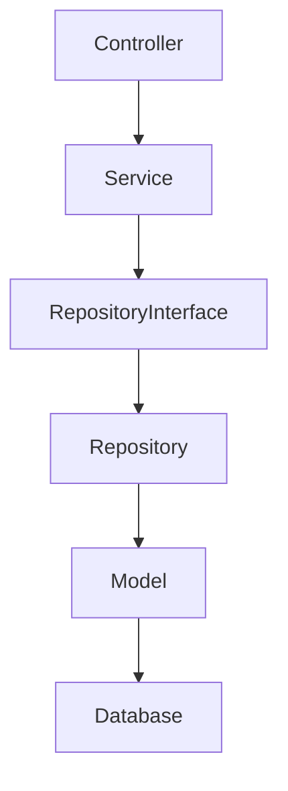
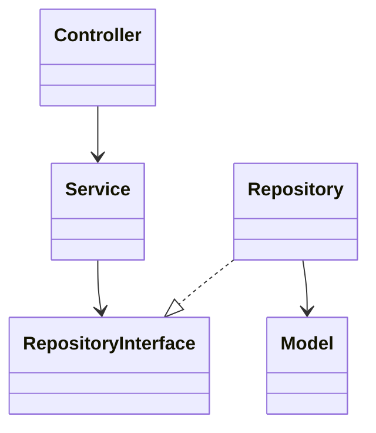

# Software Design Document (SDD)

# Chapter 19
# Design Pattern

Version : 1.0

Project :

Portfolio IT

---

# 1. Overview

Bab ini menjelaskan Design Pattern yang digunakan pada aplikasi Portfolio IT.

Design Pattern merupakan solusi umum terhadap permasalahan yang sering muncul dalam pengembangan perangkat lunak. Penggunaan pattern bertujuan meningkatkan:

- Maintainability
- Readability
- Scalability
- Testability
- Reusability

Dokumen ini menggunakan kombinasi Architectural Pattern, Creational Pattern, Structural Pattern, dan Behavioral Pattern.

---

# 2. Objectives

Tujuan penggunaan Design Pattern:

- Mengurangi coupling.
- Meningkatkan cohesion.
- Mempermudah testing.
- Mempermudah maintenance.
- Mendukung pengembangan jangka panjang.

---

# 3. Architectural Pattern

Aplikasi menggunakan **Clean Architecture** dengan pendekatan Layered Architecture.

```text
Presentation Layer

↓

Application Layer

↓

Domain Layer

↓

Infrastructure Layer
```

### Responsibility

| Layer | Responsibility |
|--------|----------------|
| Presentation | UI & API |
| Application | Business Logic |
| Domain | Business Rules |
| Infrastructure | Database, Storage, External Service |

---

# 4. Repository Pattern

Repository Pattern digunakan untuk memisahkan akses data dari business logic.

```text
Controller

↓

Service

↓

Repository Interface

↓

Repository Implementation

↓

Database
```

### Advantages

- Mudah diuji menggunakan mock.
- Mudah mengganti sumber data.
- Mengurangi ketergantungan terhadap ORM.

---

# 5. Service Layer Pattern

Business logic ditempatkan pada Service Layer.

```text
Controller

↓

Service

↓

Repository
```

Contoh service:

- AuthService
- ProfileService
- ProjectService
- CertificateService
- MessageService

---

# 6. Dependency Injection

Dependency Injection digunakan untuk mengurangi ketergantungan langsung antar kelas.

```text
Controller

↓

Interface

↓

Implementation
```

Manfaat:

- Loose Coupling.
- Mudah diuji.
- Mudah diganti implementasinya.

---

# 7. Factory Pattern

Factory digunakan untuk membuat objek dengan proses inisialisasi tertentu.

Contoh penggunaan:

- Data Seeder
- Test Data
- Dummy Project
- Dummy User

Factory mempermudah pengujian dan pengisian data awal.

---

# 8. Builder Pattern

Builder digunakan ketika suatu objek memiliki banyak properti opsional.

Contoh:

- Report Builder
- Export Builder
- PDF Builder

Keuntungan:

- Objek lebih mudah dibangun.
- Mengurangi constructor yang kompleks.

---

# 9. Singleton Pattern

Singleton digunakan pada komponen yang hanya membutuhkan satu instance.

Contoh:

- Configuration Manager
- Logger
- Cache Manager

Catatan:

Pada Laravel, Service Container mengelola lifecycle objek sehingga penggunaan Singleton dilakukan secara terkontrol.

---

# 10. Adapter Pattern

Adapter digunakan untuk mengintegrasikan layanan eksternal.

Contoh:

```text
Application

↓

Storage Adapter

↓

Local Storage

Cloud Storage
```

Keuntungan:

- Vendor dapat diganti tanpa mengubah business logic.

---

# 11. Facade Pattern

Laravel menyediakan Facade untuk menyederhanakan akses ke service.

Contoh:

- Cache
- Storage
- Mail
- Log
- DB

Facade digunakan secukupnya agar dependency tetap jelas.

---

# 12. Strategy Pattern

Strategy Pattern digunakan ketika terdapat beberapa algoritma dengan tujuan yang sama.

Contoh:

```text
Upload Strategy

↓

Local Upload

Cloud Upload
```

Contoh lain:

- Authentication Strategy
- Notification Strategy
- Export Strategy

---

# 13. Observer Pattern

Observer digunakan untuk menangani event.

Contoh:

```text
Project Created

↓

Send Notification

↓

Write Audit Log

↓

Clear Cache
```

Keuntungan:

- Mengurangi coupling.
- Mendukung event-driven architecture.

---

# 14. Command Pattern

Command digunakan untuk menjalankan proses yang dapat diantrikan.

Contoh:

- Send Email
- Generate Thumbnail
- Generate PDF
- Backup Database

Command sangat cocok diproses melalui Queue.

---

# 15. Data Transfer Object (DTO)

DTO digunakan untuk memindahkan data antar layer.

```text
Controller

↓

DTO

↓

Service
```

Keuntungan:

- Validasi lebih mudah.
- Tidak bergantung langsung pada model.
- Mengurangi parameter method yang berlebihan.

---

# 16. Dependency Flow



Dependency selalu mengarah ke lapisan yang lebih rendah.

---

# 17. Pattern Mapping

| Component | Pattern |
|------------|---------|
| Controller | MVC Controller |
| Service | Service Layer |
| Repository | Repository Pattern |
| Model | Active Record (Eloquent) |
| DTO | Data Transfer Object |
| Event | Observer |
| Queue Job | Command |
| Storage | Adapter |
| Cache | Facade |
| Seeder | Factory |

---

# 18. SOLID Implementation

### Single Responsibility Principle

Setiap kelas memiliki satu tanggung jawab utama.

### Open/Closed Principle

Fitur baru ditambahkan melalui ekstensi, bukan modifikasi.

### Liskov Substitution Principle

Implementasi interface dapat saling menggantikan.

### Interface Segregation Principle

Gunakan interface yang spesifik sesuai kebutuhan.

### Dependency Inversion Principle

Bergantung pada abstraksi, bukan implementasi.

---

# 19. UML Pattern Diagram



---

# 20. Pattern Usage Matrix

| Pattern | Status | Usage |
|----------|--------|-------|
| Layered Architecture | ✓ | Seluruh aplikasi |
| Clean Architecture | ✓ | Struktur sistem |
| Repository | ✓ | Data Access |
| Service Layer | ✓ | Business Logic |
| Dependency Injection | ✓ | Semua Service |
| DTO | ✓ | Transfer Data |
| Factory | ✓ | Seeder & Testing |
| Builder | Optional | Export/PDF |
| Singleton | Limited | Configuration |
| Adapter | ✓ | Storage & External Service |
| Facade | ✓ | Laravel Services |
| Strategy | Optional | Upload & Notification |
| Observer | ✓ | Event Handling |
| Command | ✓ | Queue Job |

---

# 21. Anti-Patterns to Avoid

Hindari praktik berikut:

- God Object.
- Massive Controller.
- Massive Model.
- Hardcoded Configuration.
- Circular Dependency.
- Business Logic di Controller.
- Duplicate Code.
- Tight Coupling.

---

# 22. Best Practices

- Gunakan Interface untuk setiap Repository.
- Tempatkan business logic di Service.
- Gunakan DTO untuk transfer data.
- Gunakan Event untuk proses asynchronous.
- Hindari ketergantungan langsung antar layer.
- Terapkan Dependency Injection.
- Gunakan Design Pattern hanya ketika memberikan manfaat nyata.

---

# 23. Future Enhancement

Apabila aplikasi berkembang, pattern berikut dapat dipertimbangkan:

- CQRS (Command Query Responsibility Segregation).
- Event Sourcing.
- Mediator Pattern.
- Specification Pattern.
- State Pattern.
- Chain of Responsibility.
- Domain-Driven Design (DDD).
- Saga Pattern untuk arsitektur microservices.

---

# 24. Summary

Design Pattern yang diterapkan pada aplikasi Portfolio IT bertujuan menciptakan struktur kode yang modular, mudah dipelihara, dan mudah diuji.

Dengan memanfaatkan Clean Architecture, Repository Pattern, Service Layer, Dependency Injection, serta pola-pola pendukung lainnya, aplikasi memiliki fondasi yang kuat untuk dikembangkan secara berkelanjutan dan siap menghadapi kebutuhan yang lebih kompleks di masa depan.